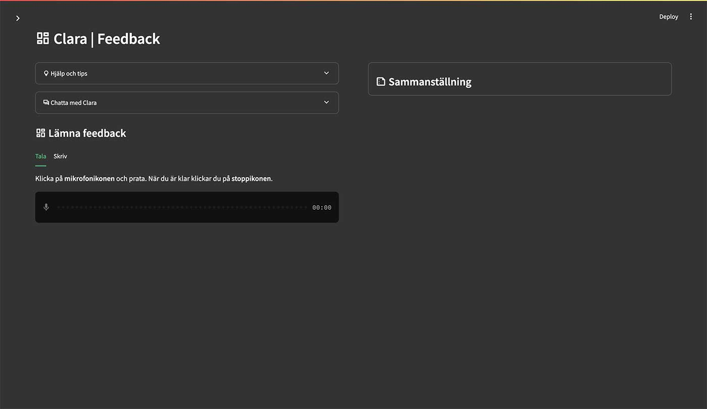
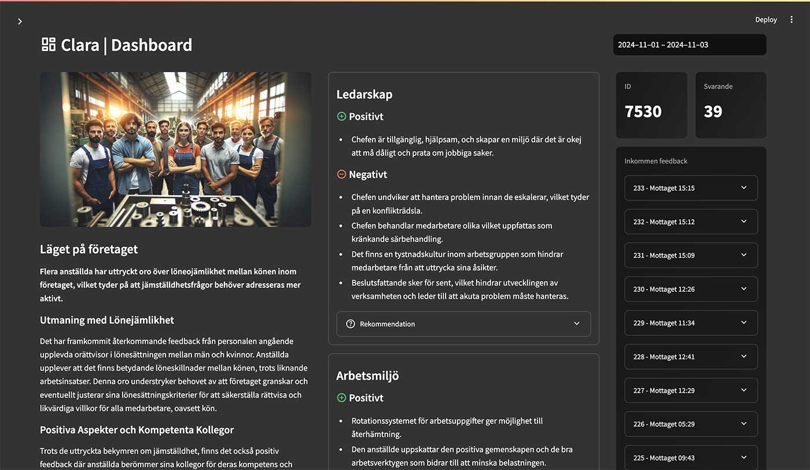

# Clara

Clara är av flera prototyper som togs fram inom projektet "Top of Mind: Jämställdhet i industrins vardag".
Projektets sida hittar du på https://www.ri.se/sv/vad-vi-gor/projekt/top-of-mind-jamstalldhet-i-industrins-vardag

## Bakgrund
**Att våga göra sin röst hörd och säga det man tycker, eller att säga ifrån, är svårt. Det kan handla om allt från att någon beter 
sig illa, till att man upplever orättvisor och ojämställdhet på sin arbetsplats. Men det kan också handla om idéer och förslag som skulle 
kunna göra arbetsplatsen bättre.**  

Clara är en prototyp som möjliggör att anonymt kunna göra sin röst hörd. Medarbetaren kan prata eller skriva in det du vill säga och AI anonymiserar det.
Medarbetaren har dessutom tillgång till en chatbot att rådfråga.  
Därefter analyseras och sammanställs alla medarbetares tankar i en dashboard, som exempelvis chefer och/eller HR skulle kunna ha tillgång till. Clara delar upp 
medarbetarnas röster i kategorierna 'Ledarskap', 'Arbetsmiljö', 'Jämställdhet', 'Övrigt' och 'Idéer'. AI hjälper dessutom till att ta fram rekommendationer 
kring kategorierna.  

## Hur funkar det?

### Feedback



Medarbetaren har tillgång till feedback-delen, där den dels kan chatta med chatboten Clara (OpenAI GPT-4o) men också att kunna prata in (OpenAI Whisper) eller skriva in sina tankar och funderingar. 
När det är gjort anonymiseras och skrivs en sammanställning (OpenAI GPT-4o) som användaren kan välja att skicka in.

### Dashboard



I dashboarden kan du välja att slå på 'Live mode' vilket hämtar in alla tankar och funderingar från medarbetarna, sammanfattar dessa och visar upp. 
Vid 'Live mode' så hämtar Clara information från databasen var 7:e sekund. När du slagit av 'Live mode' så kan du även generera rekommendationer 
till varje kategori.


## Installation
Du behöver 
- API-nyckel till OpenAI (GPT, Whisper samt Dall-E)
- API-nyckel och konto hos Supabase (Databas där information lagras)

Det här är en Streamlit-app kodad i Python och vill du enkelt sätta upp detta för test online kan du följa den installationsguide som jag gjort för en annan app på https://github.com/mickekring/gen-ai-labb
Skillnaden är att du vid steg 10 måste lägga till uppgifterna till Supabase. Pwd_on gör sidan lösenordsskyddad med det lösenord du sätter vid password.

```
openai_key = "sk-..."

pwd_on = "true"
password = "password123"

supabase_db_pass = "password123"
supabase_db = "Clara"
supabase_db_url = "https://abc.supabase.co"
supabase_db_api = "abc123"
```

### Supabase databas
Sätt upp en databas i Supabase och använd SQL härunder. Det skapas två tabeller, en för dashboarden och en för feedbacken.  
Skapa en rad i dashbordtabellen med dashboard_id satt till 7530, samma som du hittar i filen config.py. Du kan givetvis ändra detta, 
men se då till att både databasen och config.py har samma id.

```
## Admin Dashboard Table

create table admin_dashboard (
  id serial primary key,
  created_at timestamp not null default current_timestamp,
  dashboard_id int not null,
  participant_entries_ids text[] default array[]::text[],
  summarize_user_input text,
  summarize_leadership text,
  summarize_work_environment text,
  summarize_equality text,
  summarize_misc text,
  image_url text,
  summarize_ideas text,
  summarize_leadership_recommendation text,
  summarize_work_environment_recommendation text,
  summarize_equality_recommendation text,
  summarize_misc_recommendation text
);

## Feedback table

create table feedback (
  id serial primary key,
  created_at timestamp not null default current_timestamp,
  dashboard_id int not null,
  processed_text text,
  collected text
);
```

## Lokal installation
Ladda ned kod och lägg till filen /.streamlit/secrets.toml ddär du lägger in hemlligheterna som API-nycklar som ovan.  
Kör appen genom 
```
streamlit run app.py
```

## Juridisk information
Den här applikationen är inte GDPR-säkrad. Den är en del av ett utforskande och ska ses som en PoC - proof of concept.

## Vad får jag göra med koden?
Du är fri att göra vad du vill med den. Inspireras, koda om, förbättra och sprid vidare... :)
Du får också ha lite förbarmande av att koden kan vara av sisådär karaktär. Jag är bara en hobbykodare.
